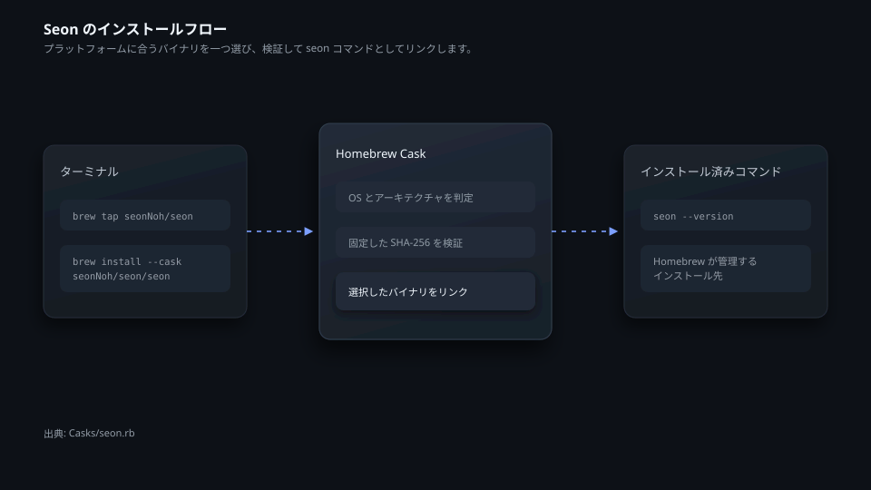
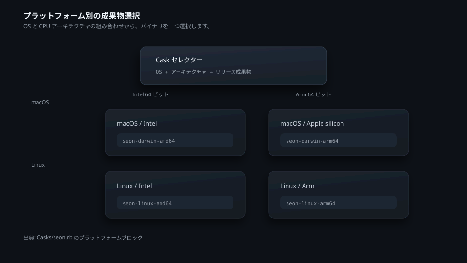
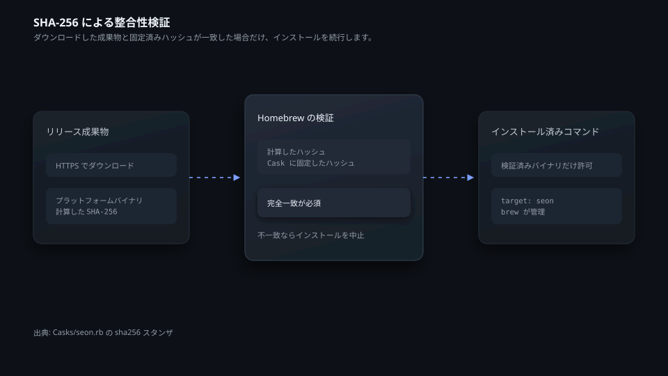
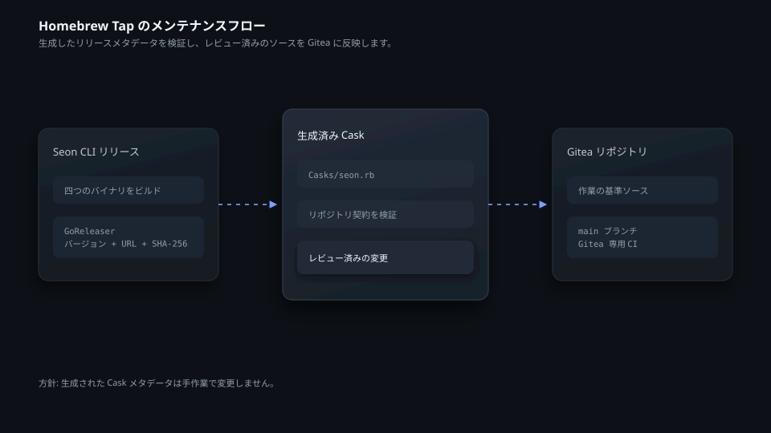

# homebrew-seon

[한국어](README.ko.md) | [English](README.md) | 日本語

`homebrew-seon` は、インフラ管理 CLI「Seon」を配布する Homebrew Tap です。macOS と Linux の Intel・Arm 環境に合ったリリースバイナリをインストールします。Homebrew は、ダウンロードしたファイルと Cask に記録された SHA-256 ハッシュを照合します。

## Seon をインストールして管理する

```bash
brew tap seonNoh/seon
brew install --cask seonNoh/seon/seon
seon --version
```

Cask の更新と削除には、Homebrew の標準コマンドを使用します。

```bash
brew update
brew upgrade --cask seon
brew uninstall --cask seon
```



## 対応環境を確認する

| OS | アーキテクチャ | Cask の成果物 |
| --- | --- | --- |
| macOS | Intel 64 ビット | `seon-darwin-amd64` |
| macOS | Apple silicon | `seon-darwin-arm64` |
| Linux | Intel 64 ビット | `seon-linux-amd64` |
| Linux | Arm 64 ビット | `seon-linux-arm64` |



## 整合性を検証する範囲

Cask は、プラットフォームごとに成果物の SHA-256 ハッシュを固定しています。Homebrew は選択したファイルをダウンロードしてハッシュを計算し、Cask の値と一致しなければインストールを中止します。現在の Cask は、Homebrew の管理下にあるコマンドを実行できるように、インストール後に macOS の隔離属性も取り除きます。



## リポジトリの変更を検証する

`Casks/seon.rb` は、Seon CLI のリリースパイプラインで GoReleaser が生成します。このファイルは手作業で変更しないでください。ドキュメント、ポリシーファイル、Gitea 専用ワークフローは、このリポジトリで管理します。変更を提案する前に、次のコマンドを実行します。

```bash
python3 verify.py
python3 -m unittest tests/test_verify.py -v
ruby -c Casks/seon.rb
```



コントリビューションの手順は [CONTRIBUTING.md](CONTRIBUTING.md) を参照してください。このリポジトリには [MIT License](LICENSE) が適用されます。
