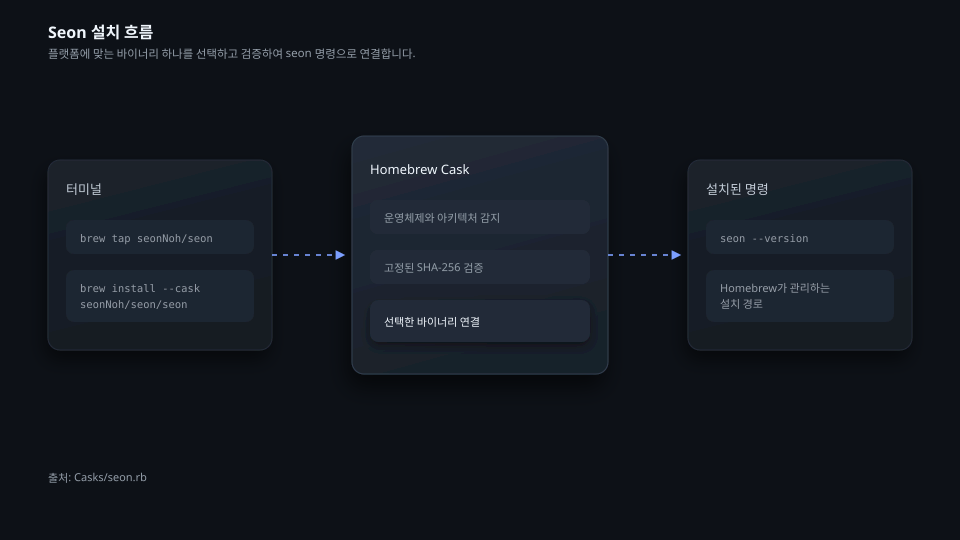
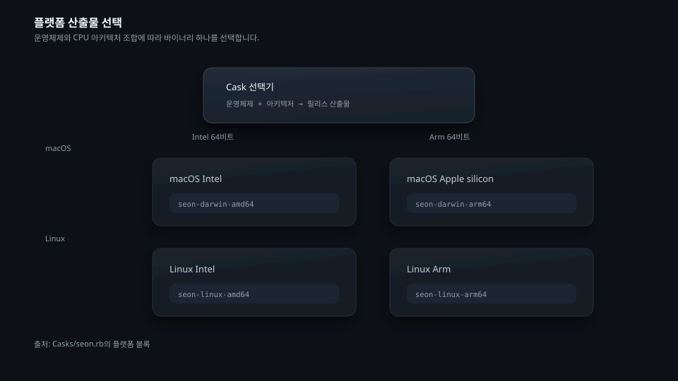
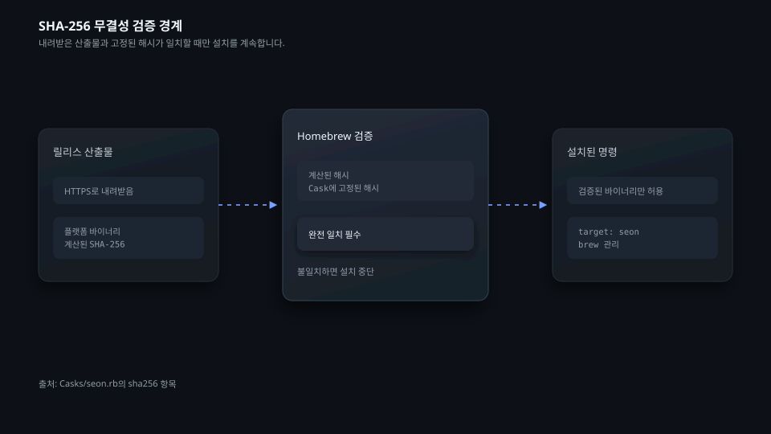
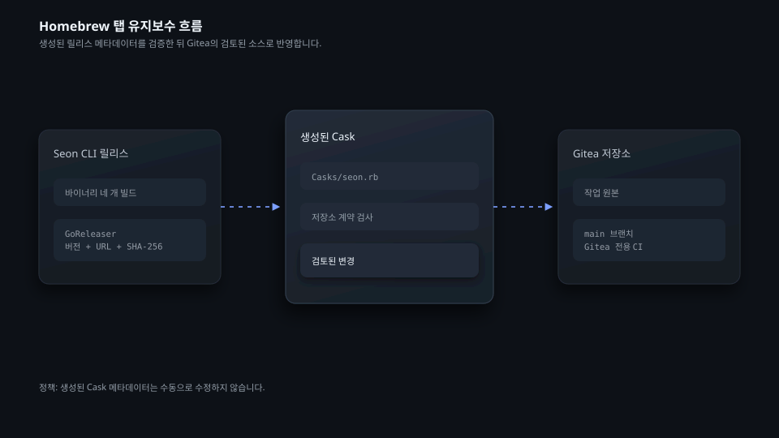

# homebrew-seon

한국어 | [English](README.md) | [日本語](README.ja.md)

`homebrew-seon`은 Seon 인프라 관리 CLI를 배포하는 Homebrew 탭입니다. 이 탭은 macOS와 Linux의 Intel 및 Arm 환경에 맞는 릴리스 바이너리를 설치하며, Homebrew는 내려받은 파일을 Cask에 기록된 SHA-256 해시와 대조합니다.

## Seon을 설치하고 관리합니다

```bash
brew tap seonNoh/seon
brew install --cask seonNoh/seon/seon
seon --version
```

다음과 같은 표준 Homebrew 명령으로 Cask를 갱신하거나 삭제할 수 있습니다.

```bash
brew update
brew upgrade --cask seon
brew uninstall --cask seon
```



## 지원 환경을 확인합니다

| 운영체제 | 아키텍처 | Cask 산출물 |
| --- | --- | --- |
| macOS | Intel 64비트 | `seon-darwin-amd64` |
| macOS | Apple silicon | `seon-darwin-arm64` |
| Linux | Intel 64비트 | `seon-linux-amd64` |
| Linux | Arm 64비트 | `seon-linux-arm64` |



## 무결성 검증 경계를 이해합니다

Cask는 플랫폼별 산출물의 SHA-256 해시를 하나씩 고정합니다. Homebrew는 선택한 파일을 내려받아 해시를 계산하고, 그 값이 Cask에 기록된 값과 다르면 설치를 중단합니다. 현재 Cask는 Homebrew가 관리하는 위치에서 명령을 실행할 수 있도록 설치 후 macOS 격리 속성도 제거합니다.



## 저장소 변경 사항을 검증합니다

`Casks/seon.rb`는 Seon CLI 릴리스 파이프라인의 GoReleaser가 생성합니다. 이 파일을 수동으로 수정하지 마십시오. 문서, 정책 파일, Gitea 전용 워크플로는 이 저장소에서 관리합니다. 변경안을 제출하기 전에 다음 명령을 실행하십시오.

```bash
python3 verify.py
python3 -m unittest tests/test_verify.py -v
ruby -c Casks/seon.rb
```



기여 방법은 [CONTRIBUTING.md](CONTRIBUTING.md)에서 확인할 수 있습니다. 이 저장소에는 [MIT License](LICENSE)가 적용됩니다.
