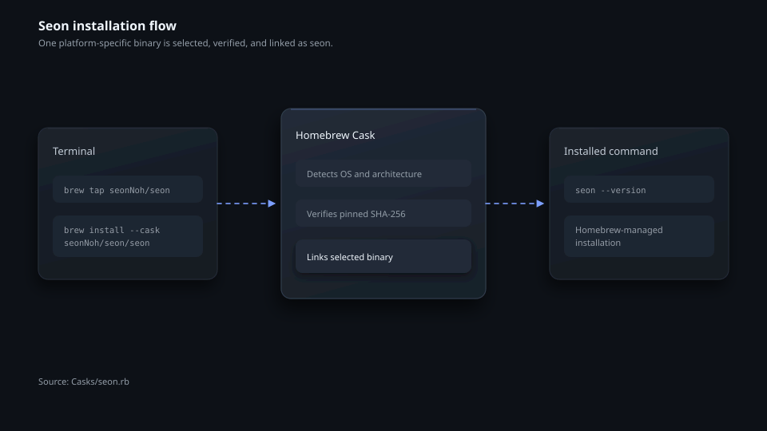
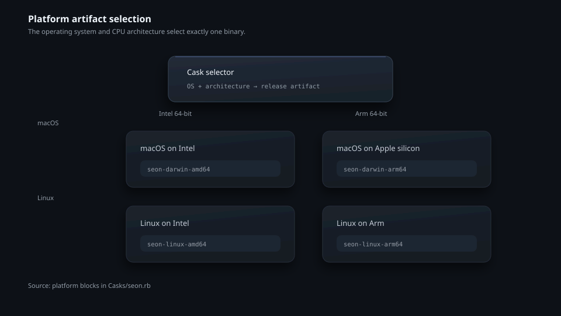
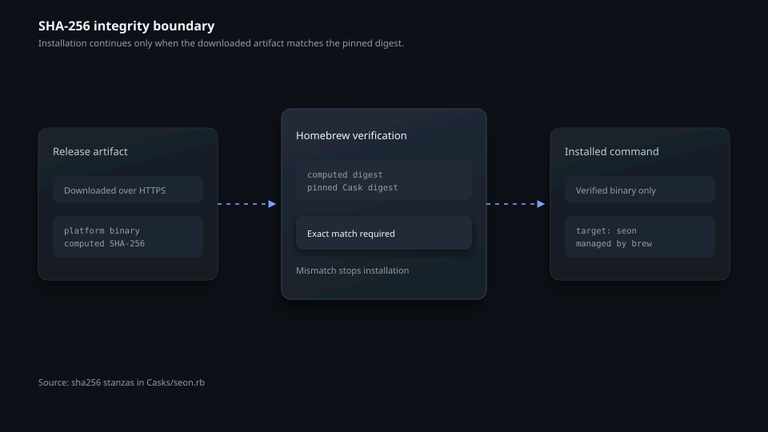
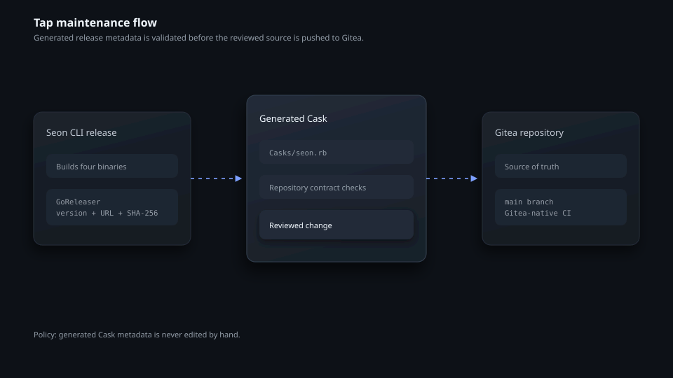

# homebrew-seon

[한국어](README.ko.md) | English | [日本語](README.ja.md)

`homebrew-seon` is the Homebrew tap for the Seon infrastructure management CLI. The tap installs signed release binaries for macOS and Linux on Intel and Arm systems, and Homebrew verifies every downloaded artifact against the SHA-256 digest recorded in the Cask.

## Install and maintain Seon

```bash
brew tap seonNoh/seon
brew install --cask seonNoh/seon/seon
seon --version
```

Upgrade or uninstall the Cask with the standard Homebrew commands:

```bash
brew update
brew upgrade --cask seon
brew uninstall --cask seon
```



## Supported platforms

| Operating system | Architecture | Cask artifact |
| --- | --- | --- |
| macOS | Intel 64-bit | `seon-darwin-amd64` |
| macOS | Apple silicon | `seon-darwin-arm64` |
| Linux | Intel 64-bit | `seon-linux-amd64` |
| Linux | Arm 64-bit | `seon-linux-arm64` |



## Integrity boundary

The Cask pins one SHA-256 digest for each platform artifact. Homebrew downloads the selected file and rejects it when the computed digest does not match the pinned value. The current Cask also removes the macOS quarantine attribute after installation so the command can run from Homebrew's managed location.



## Repository maintenance

`Casks/seon.rb` is generated by GoReleaser from the Seon CLI release pipeline. Do not edit that file manually. Documentation, policy files, and Gitea-native workflows are maintained in this repository. Run the repository verifier before proposing a change:

```bash
python3 verify.py
python3 -m unittest tests/test_verify.py -v
ruby -c Casks/seon.rb
```



For contribution rules, see [CONTRIBUTING.md](CONTRIBUTING.md). This repository is licensed under the [MIT License](LICENSE).
